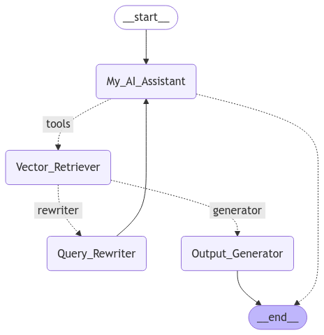

# ⚖️ Legal AI Assistant – Multimodal RAG-based AI for Indian Law  

## 🚀 Overview  
Legal AI Assistant is a **multimodal AI agent** designed to provide **accurate legal insights** on Indian law. Built with **DeepSeek R1 70B** for reasoning and **Whisper** for audio queries, it efficiently retrieves relevant legal provisions using **RAG (Retrieval-Augmented Generation)**.

## 🔹 Features  
✔ **Multimodal Support** – Text & Audio-based legal queries  
✔ **DeepSeek R1 70B** – Powerful LLM for legal reasoning  
✔ **Whisper ASR** – Converts spoken queries into text  
✔ **Query Rewriting** – Improves retrieval & response quality  
✔ **Efficient RAG Pipeline** – Retrieves laws from a **vast legal knowledge base**  

## 🛠️ Tech Stack  
- **LLM:** DeepSeek R1 70B  
- **Audio Processing:** Whisper  
- **Retrieval:** FAISS / ChromaDB  
- **Framework:** LangChain + LangGraph + Streamlit  
- **Database:** VectorDB for structured legal data  

## 📌 Installation  
# Project Setup

Follow these steps to set up and run the project:

## 1. Clone the Repository  
```sh
git clone https://github.com/jasgithub101/IndianLawAI.git
cd /IndianLawAI
```

## 2. Generate `requirements.txt`  
```sh
pip freeze > requirements.txt
```

## 3. Get API Key from Groq  
Sign up at [Groq](https://www.groq.com/) and obtain an API key.

## 4. Set API Key as an Environment Variable  
### Windows (Command Prompt)  
```sh
set GROQ_API_KEY=<your_api_key>
```
### Windows (PowerShell)  
```sh
$env:GROQ_API_KEY="<your_api_key>"
```
### macOS & Linux (Bash)  
```sh
export GROQ_API_KEY=<your_api_key>
```

## 5. Create a Virtual Environment  
### Windows  
```sh
python -m venv venv
venv\Scripts\activate
```
### macOS & Linux  
```sh
python3 -m venv venv
source venv/bin/activate
```

## 6. Install Dependencies  
```sh
pip install -r requirements.txt
```

## 7. Run the Application  
```sh
streamlit run legal-rag.py
```


## ⚙️ How It Works  
1. **User Inputs Query** – Text or voice-based legal question  
2. **Query Processing** – LLM rewrites the query for better understanding  
3. **Document Retrieval** – Searches for relevant legal provisions  
4. **AI Response Generation** – Context-aware, citation-backed answers
   
---
## Workflow Diagram


---

## 📖 Key Learnings  
✅ **Prompt Engineering** is crucial for accurate legal responses  
✅ **Optimized Vector Databases** improve retrieval efficiency  
✅ **Query Rewriting** enhances RAG precision for better answers  

---

## 📌 Future Improvements  
🔹 Expanding the Knowledge Base to cover more legal texts and case laws  
🔹 Better Document Retrieval Techniques for improved accuracy  
🔹 More Comprehensive Pipeline to enhance efficiency and scalability  
---

## 👨‍💻 Contributing  
Want to contribute? Feel free to **fork the repo** and submit a PR!  

---

## 🔗 Connect with Me  
**LinkedIn:** [Jaswanth Pasumarthy](https://www.linkedin.com/in/jaswanth-pasumarthy-671a21214/)

---

⭐ **Star this repo** if you find it useful! 🚀 
